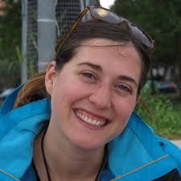

# [Hackathon MoDaL Biogenouest 2021](https://biogenouest.github.io/biogen-hack-2020/)

Nous sommes ravis de vous annoncer que le hackathon MoDaL aura lieu les 25 janvier et le 1er février 2021 !

Après vous avoir questionné autour de vos expériences et attentes en intégration de données, nous avons perçu un vrai intérêt sur cet aspect de l’analyse des données et un intérêt croissant pour les principes FAIR. 

Le Hackathon aura pour but le travail collaboratif, le partage d'expériences et de  connaissances et la co-conception de solutions informatiques innovantes autour de l’intégration de données hétérogènes. 

Lors de cet événement, nous travaillerons ensemble sur des **mini-projets** de votre choix. Pendant ce temps chaque compétence est la bienvenue, en bio-informatique et dans le domaine de la science de la vie. 

Tous les projets seront présentés lors du premier jour du Hackathon et chaque participant pourra décider auquel collaborer !

D'autres espaces seront également à votre disposition : 
- **Exposés flash**, où chacun d’entre vous pourra exposer brièvement (environ 5 min) un retour d’expérience en intégration de données, un outil ou un sujet qui vous tient à cœur !
- **Tutoriels**, facultatif, sera prévu en parallèle au travail sur les mini-projets. Ces tutoriels dureront environ 30 min et cibleront un outil et/ou une méthode autour de l’intégration de données et des principes FAIR.   

**N'hesitez pas, au cours du hackathon, à vous manifester pour proposer un sujet et l'exposer !!**

# Sommaire 
- [Mini-projets](#Mini-projets)
- [Pré-programme](#Pré-programme)
- [Informations utiles](#Informations-utiles)
- [Organisateurs](#Organisateurs)

# Mini-projets   

[SOUMETTRE UN MINI-PROJET](soumettre_projet.html)   

|Titre|Personne contact|
| ------------- | ------------- |
|[GenFlow](GenFlow.html)|Thomas Darde|
|[Humess](Humess.html)|Philippe Bordron|
|[Adipodata, an integrative view ?](Adipodata.html)|Isabelle Hue|
|[Federated queries on imaging and genomics data](fed-queries.html)|Olivier Dameron,Camille Maumet|
|[Data about data](data-about-data.html)|Alban Gaignard, Audrey Bihouée, Sofia Strubbia|
|[M2A (Metabolights to AuReMe)](M2A.html)|Gabriel MARKOV|
|[Bien-être du cheval de sport : recherche d'une signature transcriptomique du niveau d'agressivité ](bien-etre_cheval.html)|Aline FOURY|
|[Détection du Norovirus en France](norovrus.html)|Alban Besnard|

## [GenFlow](GenFlow.html)

### Personne contact : 
Thomas Darde

### Description du projet :
Développement d’un espace de dépôt pour les workflows utilisés lors de l’analyse de données génomique issus de publications scientifique. Chaque workflow est extrait automatiquement de la publication quand c’est possible (text minning) ou les utilisateurs peuvent déployer leurs propres workflows via une interface dédiée. Toute information déposée sur cet espace doit être caractérisée par l’utilisation de vocabulaire contrôlé.

## [Humess](Humess.html)

### Personne contact : 
Philippe Bordron

### Description du projet :
Humess est un projet de reconstruction à façon de réseaux métaboliques humains fontionnels à partir de données d’expression de 3’SRP ainsi que de leur analyse à l’aide d’une approche de corrélation de flux métabolique.

À partir de réseaux métaboliques fonctionnels, les analyses en corrélation de flux métabolique produises de grandes matrice de corrélation entre réactions (environ 5000x5000 en moyenne sur un réseau humain). Ces matrices donne une sur-approximation de la dynamique métabolique existant dans les réseaux étudiés. Dans le cadre de ce hackathon, je souhaite travailler sur les représentations et l’accessibilité des obtenus.

## [Adipodata, an integrative view ?](Adipodata.html) 

### Personne contact :
Isabelle Hue

### Description du projet  :
Analyse in silico de données publiées sur les adipocytes de diverses espèces:

- **(i)** sgle-cell RNAseq chicken breast muscle => sous populations cellulaires https://bigd.big.ac.cn/search/?dbId=gsa&q=CRA002353

- **(ii)** LncRNAs fatty/lean pig meat: pas de dépot de données identifié, cf publi https://doi.org/10.1021/acs.jafc.8b04243

- **(iii)** adipocyte secretome: autocrine/paracrine/endocrine signaling: https://doi.org/10.1007/s00018-019-03256-5 (human data) Human Adipokine ELISA kit: epitopes? primary/tertiary structure?

- **(iv)** Oncorhynchus mykiss (rainbow trout) genome => orthologous gene mapping

## [Federated queries on imaging and genomics data](fed-queries.html) 

### Personne contact :
Olivier Dameron, Alban Gaignard, Camille Maumet

### Description du projet :
Nous proposerons et évaluerons des requêtes SPARQL fédérées, afin de pouvoir interroger des bases de données multi-sites et limiter la centralisation des données. Dans ce projet les données sont stockées en RDF et incluent des observations cliniques, des IRM et des données génomiques sur des patients atteints d’anévrismes intracrâniens. 

## [Data about data](data-about-data.html)

### Personne contact :
Alban Gaignard, , Audrey Bihouée, Camille Maumet, Sofia Strubbia

### Description du projet :
Ce projét est autour de la découvrabilité des données. L'objectif est de répondre aux questions des chercheurs qui souhaitent faire connaître les informations relatives à leurs jeux de données sans pour autant partager les données elles-mêmes. Comment décrire les échantillons ? Quelles informations partager ? Comment indexer ces données ? De même, des questions similaires peuvent se présenter aux experts en science du numérique au moment de sélectionner ou réutiliser un jeu de données.

## [M2A (Metabolights to AuReMe)](M2A.html)

### Personne contact
Gabriel MARKOV (GitHub: gabrielmarkov)

### Description du projet :
Les réseaux métaboliques à l'échelle du génome (RMEG) représentent l'ensemble des connaissances sur le métabolisme d'une espèce donnée. Ils sont pour l'essentiel construits sur la base d'informations génomiques, mais peuvent être enrichis par des données métabolomiques. Toutefois, l'interopérabilité entre ces deux types de données est limitée par le développement inégal des bases de données métabolomiques par espèces par rapport aux bases de données de séquences protéiques. Par exemple, la base de données MetaboLights (infrastucture ELIXIR) propose de mettre à disposition ce type de données [doi: 10.1093/gigascience/gix062](http://doi:10.1093/gigascience/gix062), mais son utilisation reste limitée du fait de la barrière d'entrée élevée pour les nouveaux utilisateurs, alors même que les données correspondantes ont parfois été compilées. C'est le cas pour plusieurs espèces de macroalgues, pour lesquelles des RMEGs ont été reconstruits récemment: l'algue rouge Chondrus crispus [doi: 10.1016/j.isci.2020.100849](https://pubmed.ncbi.nlm.nih.gov/32058961/) et les algues brunes Cladosiphon okamuranus et Saccharina japonica [doi:10.3390/antiox8110564](https://doi:10.3390/antiox8110564).
L'objectif du projet sera de finaliser la soumission de ces données dans Metabolights et de réfléchir à la meilleure manière de mettre à jour cette information dans les RMEGs correspondants disponibles sur [http://aureme.genouest.org/wiki.html](http://aureme.genouest.org/wiki.html).

## [Bien-être du cheval de sport : recherche d'une signature transcriptomique du niveau d'agressivité ](bien-etre_cheval.html)

### Personne contact
Aline FOURY

### Description du projet :
L'étude concerne 18 chevaux de sport, 9 chevaux non agressifs et 9 chevaux agressifs. Chaque cheval est caractérisé par un score d'agressivité. L'ARN a été extrait à partir du sang total afin de réaliser une analyse transcriptomique. Le but du projet est d'identifier les gènes marqueurs de l'agressivité chez le cheval ainsi que les voies métaboliques dans lesquelles ils sont impliqués.

## [Détection du Norovirus en France](norovrus.html)

### Personne contact
Alban Besnard

### Description du projet :
L'IFREMER travaille sur le norovirus (pathogène provoquant la gastro-entérite humaine). Nous avons des données provenant d'échantillons différents: Huîtres / eaux usées / Humains. Ces données sont assez diverses et vont de la séquence complète d'un génome identifié à la simple détection présence/absence du virus.L'objectif est de construire une base de données permettant de l'interroger pour récupérer toutes les analyses faites sur un échantillon, sur une période temporelle et/ou géographique.

  
# Pré-programme 

**Lundi 25 (9h30 - 16h30)** 

9h30-10h :  Introduction
  10h-12h :   Présentation de mini projets (2-3 diapos par projet / environ 5 min) et travail en groupe sur les mini-projets 

  14h - 14h30 : Exposés flash flash
  14h30 - 15h : Travail en groupe sur les mini-projets
  15h - 15h30 : (facultatif) tutoriel 
  16h - 16h30 : Checkpoint avancement des projets 

**Lundi 1 (10h - 16h30)**

10h - 10h15 : Bonjour - questions ? 
  10h15 - 12h : Travail en groupe sur les mini-projets 
  11h - 11h30 : (facultatif) tutoriel  

  14h - 14h30 : Exposés flash flash 
  14h30 - 15h : Travail en groupe sur les mini-projets
  15h - 16h   : Expo résultats obtenus par groupe 
  16h - 17h : Conclusions

# Informations utiles 
Nous allons utiliser [gather.town](https://gather.town/) comme système visuel, pas de compte à créer !   
Ce logiciel peut être utilisé sur n'importe quel ordinateur (portable, de bureau) sous n'importe quel système d'exploitation (Windows, Mac OS, Linux). 
Il ne prend en charge que Google Chrome et Firefox. 
Assurez-vous que votre caméra et votre microphone fonctionnent correctement !

Cet outil n'a pas d'exigences particulières quant à la vitesse du réseau ou de l'ordinateur, mais les spécifications suivantes sont recommandées pour une expérience idéale :

3Mbps en bas/1Mbps en haut
CPU 2.4ghz dual core
8gb RAM

[Welcome to gather](https://docs.google.com/document/d/1kngaWIQSHlSOfNq6S2s9SLy_o6GvLMmkxcpv4AvuMrc/edit)

# Organisateurs

[Projet fédérateur MoDaL](Projet_modal.html)

## L'équipe MoDaL se présente : 

| | |
|-----------|-----|
|**Alban Gaignard**   |Alban est ingénieur de recherche CNRS à l'Institut du Thorax à Nantes. Ses recherches portent sur la représentations des connaissance (web sémantique, données liées) et les systèmes distribués (workflows, provenance) pour mieux intégrer et réutiliser les données des sciences de la vie. Depuis 2019, pour l’institut francais de bioinformatique (IFB), il co-anime l’action nationale “interopérabilité” et contribue à l'infrastructure européenne de bioinformatique Elixir.|
|**Camille Maumet**   |Camille est chargée de recherche en neuroinformatique à Inria, Univ Rennes, CNRS, Inserm dans l'équipe Empenn. Camille développe des méthodes statistiques et informatiques pour permettre le partage et la réutilisation de données en imagerie cérébrale. Elle soutient aussi activement la science ouverte. Elle a été précédemment post-doc à l'université de Warwick et à l'université d'Oxford où elle s'est intéressée aux méta-analyses d'images de résonance magnétique fonctionnelle.|
|**Sofia Strubbia**     |Sofia est ingénieure de recherche INSERM au sein de l'Institut du Thorax, à Nantes. De formation vétérinaire, elle s’est spécialisée en sécurité alimentaire avant de se former aux problématiques de Santé Unique. Elle est titulaire d’un doctorat en microbiologie, spécialité virologie. Sofia c’est formée à la métagénomique virale sur des échantillons environnementales au sein du laboratoire “Virus Discovery” de l’Erasmus Medical Center, Rotterdam. Depuis 2020 elle est animatrice du projet fédérateur MoDaL au sein de Biogenouest.|
**Olivier Dameron**    |Olivier est professeur d’informatique à l’université de Rennes 1 et responsable de l’équipe Dyliss au laboratoire IRISA à Rennes. Il développe des méthodes basées sur les ontologies pour intégrer, interroger et analyser des données biomédicales. Cela fait intervenir des compétences en représentation des connaissances et en bioinformatique et repose sur le Web Sémantique et les données liées.|
|**Audrey Bihouée**         |Audrey est ingénieur d’études à l’Université de Nantes, et responsable technique de la plateforme de Bioinformatique BiRD. Après un master en neurosciences, elle a obtenu une double-compétence en informatique grâce à un master complémentaire. Elle a intégré la plateforme d’abord sur le volet bio-analyse de projets transcriptomiques et occupe aujourd’hui des missions de coordination dans les réseaux des plateformes de Biogenouest et de l’IFB.|
|**Anne Siegel**      |Anne est directrice de recherche au CNRS, et exerce ses recherches dans l’équipe Dyliss au laboratoire IRISA à Rennes. Elle est responsable du département « Gestion des données et connaissances » à l’IRISA et chargée de mission “bioinformatique” au CNRS (INS2I). Elle a obtenu un doctorat en mathématiques avant de s’intéresser aux interfaces entre la biologie et l’informatique en développant des approches symboliques de représentation et d’intégration de connaissances pour analyser des réseaux biologiques à grande-échelle.|

Pour toutes informations complémentaires : [sofia.strubbia@univ-nantes.fr](sofia.strubbia@univ-nantes.fr)
