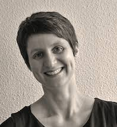
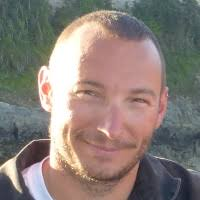

# [Hackathon MoDaL Biogenouest 2021](https://biogenouest.github.io/biogen-hack-2020/)

Nous sommes ravis de vous annoncer que le hackathon MoDaL aura lieu les 25 janvier et le 1er février 2021 !

Après vous avoir questionné autour de vos expériences et attentes en intégration de données, nous avons perçu un vrai intérêt sur cet aspect de l’analyse des données et un intérêt croissant pour les principes FAIR. 

```diff
- text in red
+ text in green
! text in orange
# text in gray
@@ text in purple (and bold)@@
```

Le Hackathon aura pour but le travail collaboratif, le partage d'expériences et de  connaissances et la co-conception de solutions informatiques innovantes autour de l’intégration de données hétérogènes. 

Lors de cet événement, nous travaillerons ensemble sur des mini-projets de votre choix. Pendant ce temps chaque compétence est la bienvenue, en bio-informatique et dans le domaine de la science de la vie. 

Tous les projets seront présentés lors du premier jour du Hackathon et chaque participant pourra décider auquel collaborer !

D'autres espaces seront également prévus :
- **Exposés flash**, où chacun d’entre vous pourra exposer brièvement (environ 5 min) un retour d’expérience en intégration de données, un outil ou un sujet qui vous tient à cœur !
- **Tutoriels**, facultatif, sera prévu en parallèle au travail sur les mini-projets. Ces tutoriels dureront environ 30 min et cibleront un outil et/ou une méthode autour de l’intégration de données et des principes FAIR. 


[SOUMETTRE UN MINI-PROJET](soumettre_projet.html)

# Pré-programme 

**Lundi 25 (9h30 - 16h30)** 

9h30-10h :  Introduction (projet MoDaL et objectifs de ce hackathon (10min)
            Retour du formulaire (10min) ? 
            Expliquer comment ça marche le logiciel que nous allons utiliser (5min)
            Présenter le welcome desk (5min) et du programme (5 min)
<br/> 10h-12h :   Présentation de mini projets (2-3 diapos par projet / environ 5 min) et travail en groupe sur les mini-projets 

<br/> 14h - 14h30 : Exposés flash flash
<br/> 14h30 - 15h : Travail en groupe sur les mini-projets
<br/> 15h - 15h30 : (facultatif) tutoriel 
<br/> 16h - 16h30 : Checkpoint avancement des projets, retour d’expérience, propositions pour les non-conf ou tutoriel le lendemain 

**Lundi 1 (10h - 16h30)**

10h - 10h15 : Bonjour - questions ? 
<br/> 10h15 - 12h : Travail en groupe sur les mini-projets 
<br/> 11h - 11h30 : (facultatif) tutoriel  

<br/> 14h - 14h30 : Exposés flash flash 
<br/> 14h30 - 15h : Travail en groupe sur les mini-projets
<br/> 15h - 16h   : Expo résultats obtenus par groupe 
<br/> 16h - 16h30 : Conclusions


# Organisateurs

[Projet fédérateur MoDaL](Projet_modal.html)

## L'équipe MoDaL se présente : 

| | |
|-----------|-----|
|**Alban Gaignard**   |Alban est ingénieur de recherche CNRS à l'Institut du Thorax à Nantes. Ses recherches portent sur la représentations des connaissance (web sémantique, données liées) et les systèmes distribués (workflows, provenance) pour mieux intégrer et réutiliser les données des sciences de la vie. Depuis 2019, pour l’institut francais de bioinformatique (IFB), il co-anime l’action nationale “interopérabilité” et contribue à l'infrastructure européenne de bioinformatique Elixir.|
|**Camille Maumet**   |Camille est chargée de recherche en neuroinformatique à Inria, Univ Rennes, CNRS, Inserm dans l'équipe Empenn. Camille développe des méthodes statistiques et informatiques pour permettre le partage et la réutilisation de données en imagerie cérébrale. Elle soutient aussi activement la science ouverte. Elle a été précédemment post-doc à l'université de Warwick et à l'université d'Oxford où elle s'est intéressée aux méta-analyses d'images de résonance magnétique fonctionnelle.|
|**Sofia Strubbia**     |Sofia est ingénieure de recherche INSERM au sein de l'Institut du Thorax, à Nantes. De formation vétérinaire, elle s’est spécialisée en sécurité alimentaire avant de se former aux problématiques de Santé Unique. Elle est titulaire d’un doctorat en microbiologie, spécialité virologie. Sofia c’est formée à la métagénomique virale sur des échantillons environnementales au sein du laboratoire “Virus Discovery” de l’Erasmus Medical Center, Rotterdam. Depuis 2020 elle est animatrice du projet fédérateur MoDaL au sein de Biogenouest.|
**Olivier Dameron**    |Olivier est professeur d’informatique à l’université de Rennes 1 et responsable de l’équipe Dyliss au laboratoire IRISA à Rennes. Il développe des méthodes basées sur les ontologies pour intégrer, interroger et analyser des données biomédicales. Cela fait intervenir des compétences en représentation des connaissances et en bioinformatique et repose sur le Web Sémantique et les données liées.|
|**Audrey Bihouée**         |Audrey est ingénieur d’études à l’Université de Nantes, et responsable technique de la plateforme de Bioinformatique BiRD. Après un master en neurosciences, elle a obtenu une double-compétence en informatique grâce à un master complémentaire. Elle a intégré la plateforme d’abord sur le volet bio-analyse de projets transcriptomiques et occupe aujourd’hui des missions de coordination dans les réseaux des plateformes de Biogenouest et de l’IFB.|
|**Anne Siegel**      |Anne est directrice de recherche au CNRS, et exerce ses recherches dans l’équipe Dyliss au laboratoire IRISA à Rennes. Elle est responsable du département « Gestion des données et connaissances » à l’IRISA et chargée de mission “bioinformatique” au CNRS (INS2I). Elle a obtenu un doctorat en mathématiques avant de s’intéresser aux interfaces entre la biologie et l’informatique en développant des approches symboliques de représentation et d’intégration de connaissances pour analyser des réseaux biologiques à grande-échelle.|
